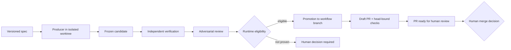

<p align="center">
  
</p>

<p align="center">
  <a href="#quick-start"></a>
</p>

<p align="center">
  
  
  
  
</p>

**Verified coding-agent delegation for Claude Code.** Claude authors a versioned Autopilot Spec; the trusted runtime coordinates fresh-context Producers, freezes and verifies their candidates, promotes only hash-bound eligible bytes to a workflow-owned feature branch, reviews the cumulative branch, and ships it to a pull request ready for human review. Implementation can use **Codex, OpenCode, Pi, or Pythinker**. Only a human may merge the PR or otherwise advance `main`.

In practice that means three guarantees the plugin enforces in host code, not in prompts:

- **Isolation** — every Producer runs in a detached worktree with a sanitized environment, an explicit write allowlist, and OS sandboxing where certified. Out-of-scope changes are rejected at freeze time.
- **Evidence over claims** — a Producer saying "tests pass" is never accepted; the runtime reruns your authorized verification commands in a clean worktree and records the real output.
- **Policy-gated promotion** — Producers, reviewers, advisors, skills, and MCP callers cannot construct or waive Autopilot Eligibility. Only the trusted Promotion module can record `accepted` with authority `autopilot-policy`, and only for controlled integration into the workflow branch.

## Status

> **Public beta:** Do not use Claude Architect unattended for production, destructive, or security-sensitive work. Review the complete candidate and verification evidence before integration.

The runtime and cross-platform lifecycle are evolving. Producer availability depends on the host OS, CLI version, authentication, requested lane, and proven execution capabilities.

## Why it exists

Delegating code generation is easy; establishing which exact bytes were produced, whether they stayed in scope, and whether cumulative task interactions were independently verified is harder. Claude Architect treats external coding agents as untrusted Producers. It records reproducible runs, freezes content-addressed candidates, verifies authorized checks in clean materializations, and retains workflow evidence through promotion, shipping, and recovery.

## Core workflow



All agent output is an untrusted candidate. A human may record any Candidate Decision after reviewing evidence; autopilot may record policy acceptance only from current hash-bound eligibility. Policy acceptance is not merge authority.

## Installation

Claude Code requires Node.js 22 or newer. Add the marketplace and install the plugin:

```bash
claude plugin marketplace add Pythoughts-labs/claude-architect
claude plugin install claude-architect@claude-architect
claude plugin list --json
```

Restart Claude Code after installing or updating. Install and authenticate at least one supported Producer CLI (`codex`, `opencode`, `pi`, or `pythinker`); Claude Architect reports unavailable lanes rather than silently substituting another agent.

## Quick start

Open Claude Code in a Git repository and name the Producer you want:

```text
/claude-architect:delegate Use Codex to add rate limiting to the public API, verify the cumulative workflow branch, and prepare a PR for my review without merging it.
```

If no Producer is named, the skill asks you to choose Codex, OpenCode, Pi, or Pythinker. Pi, OpenCode, and Pythinker are harnesses that accept optional model and thinking/variant overrides; model selection within a harness lane is optional and otherwise defers to that CLI's configured default. The skill starts the controller with `autopilotStart`, observes durable state with `autopilotStatus`, and uses `autopilotResume` after an interruption. The manual candidate lifecycle is used only when you explicitly choose it.

Autopilot shipping v1 requires GitHub CLI 2.96 or newer, CLI authentication, an `origin` that is an authenticated GitHub HTTPS remote, and configured required checks that become green for the exact workflow head. Project-scoped permissions in `.claude/settings.json` take effect only after workspace trust and cannot override managed `ask` or `deny` policy. Thus “no mid-loop prompts” is conditional on workspace trust, effective permission policy, and every runtime gate remaining objectively proven.

## Available skills, agents, and MCP tools

| Kind | Name | Purpose |
|---|---|---|
| Skill | `/claude-architect:delegate` | Builds an Autopilot Spec and drives the controller to a PR ready for human review. |
| Agent | `advisor` | Current strictly read-only commitment-boundary advisor. |
| MCP | `delegate` | Runs one validated, isolated, independently verified attempt. |
| MCP | `delegatePipeline` | Runs the fresh-context implement/review/repair pipeline. |
| MCP | `reviewCandidate` | Returns the exact frozen patch and verification evidence. |
| MCP | `decideCandidate` | Records accepted, rejected, or revision-requested. |
| MCP | `integrateCandidate` | Applies an accepted hash-matched candidate under safety guards. |
| MCP | `autopilotStart` | Starts a validated workflow; policy, promotion, shipping, and cleanup remain inside the controller. |
| MCP | `autopilotStatus` | Reads durable workflow state without mutation. |
| MCP | `autopilotResume` | Resumes a non-terminal interrupted workflow from corroborated durable state. |
| MCP | `doctor` | Reports runtime, Git, platform, and Producer diagnostics. |
| MCP | `gitStatus`, `gitDiff`, `gitLog`, `gitChangedFiles` | Bounded, redacted, read-only Git evidence for advisors. |

## Security and trust model

Claude Architect separates authority across roles and artifacts. Producers receive bounded write scope in isolated worktrees. Candidate bytes are frozen and identified by hashes before independent verification. Reviewers and advisors are fresh and read-only. The runtime rejects nested delegation, scope escapes, case-colliding paths, changed bases, mismatched anchors or trees, stale required-check observations, and ineligible promotion.

The lifecycle terms are distinct: **accepted** means a hash-bound Candidate Decision permits controlled integration into the workflow branch; **shipped** means the exact workflow head was pushed and a draft PR identity was established; **ready** means configured required checks were green for that exact head and the PR was marked ready for human review; **merged** means a human advanced `main`. The runtime never performs the last step. Verification reduces risk but does not establish that a change is safe for your deployment.

## Permissions and external commands

The plugin starts its MCP server with `${CLAUDE_PLUGIN_ROOT}/runtime/bootstrap.mjs`. It may invoke Git, Node.js, configured verification executables, a selected Producer CLI, and—only for shipping v1—the authenticated GitHub CLI. Producer processes can edit only through an eligible isolated lane; verification commands are Host-authorized and their confinement/network enforcement is reported honestly. The runtime uses executable-plus-argv invocation, sanitized environments, bounded timeouts, process-tree termination, executable policy, and path validation. Never authorize secrets, deployment commands, destructive commands, or broader write globs than the task requires.

Codex edit confinement uses `codex-native-sandbox`: native macOS arm64 is certified, Linux is tested where unprivileged user namespaces permit the native sandbox, and native Windows editing is unsupported. Unsupported or failed confinement is diagnostics-only and fails closed. The Codex adapter enforces `--disable multi_agent` together with `features.multi_agent_v2={enabled=false,max_concurrent_threads_per_session=1}`. Installed marketplace copies must update and reload Claude Code before a new runtime or adapter controls take effect.

## Data storage and privacy

Durable run state, manifests, frozen artifacts, decisions, workflow journals, final whole-branch evidence, CI observations, ownership records, and recovery metadata are stored beneath `${CLAUDE_PLUGIN_DATA}`. Active workflow worktrees and local refs remain owned by the workflow. Successful ready-state cleanup removes temporary local worktree/lock/ref resources but retains the remote workflow branch, PR, and durable evidence; fail-closed outcomes retain inspection and recovery evidence. Production runs do not fall back to an implicit state directory.

Logs and MCP evidence are bounded and redacted; prompt/argument values are not intentionally logged. Producer CLIs and any configured model providers have their own telemetry, retention, and privacy policies. Do not place credentials or sensitive data in delegation specs, prompts, test fixtures, or command arguments.

## Limitations and non-goals

- This is a public beta. Autopilot is autonomous only up to a PR ready for human review; it never automatically merges, deploys, releases, or deletes the remote workflow branch.
- It does not prove business correctness, eliminate supply-chain risk, or replace human security review.
- Native Codex edit confinement is certified on macOS arm64 and tested on eligible Linux hosts; native Windows Codex editing is not certified. Other Producer/platform combinations may be tested, diagnostics-only, or unavailable.
- Every Producer must pass the runtime's capability and confinement checks. An unavailable requested Producer is reported and fails closed; the runtime does not substitute another Producer or bypass a denied edit lane.
- Verification commands are evidence, not automatically sandboxed build infrastructure.
- Manual integration stages an accepted candidate but never commits or ships it. Autopilot commits only to its workflow-owned feature branch and may push/create/ready its PR under the shipping contract; neither path merges, deploys, releases, or deletes the remote branch.

## Development and testing

```bash
npm install
npx tsc --noEmit
npx vitest run
bash scripts/validate-release.sh
claude plugin validate .
```

Enable local push gates once per clone:

```bash
git config core.hooksPath .githooks
```

See [AGENTS.md](AGENTS.md) for architecture boundaries, trust invariants, testing requirements, packaging rules, and the minor-version-only release policy.

## Support and security reporting

Use [GitHub Issues](https://github.com/Pythoughts-labs/claude-architect/issues) for reproducible bugs and support questions. For a suspected vulnerability, use the repository's private GitHub security reporting channel rather than a public issue. Include the plugin version, host OS/architecture, Claude Code version, Producer CLI/version, redacted diagnostics, and reproduction steps.

## Contributing

Contributions are welcome. Keep changes narrowly scoped, add tests that prove the relevant trust property, run all repository checks, and explain platform or security implications. Read [AGENTS.md](AGENTS.md) before working on the runtime.

## License

Claude Architect is licensed under the [MIT License](LICENSE).
