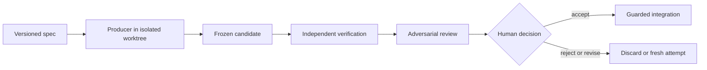

# Claude Architect

Verified coding-agent delegation for Claude Code: isolate untrusted Producers, freeze their output, verify it independently, and leave acceptance to you.

 

## Status

> **Public beta:** Do not use Claude Architect unattended for production, destructive, or security-sensitive work. Review the complete candidate and verification evidence before integration.

The runtime and cross-platform lifecycle are evolving. Producer availability depends on the host OS, CLI version, authentication, requested lane, and proven execution capabilities.

## Why it exists

Delegating code generation is easy; establishing which exact bytes were produced, whether they stayed in scope, and whether anyone independent verified them is harder. Claude Architect keeps Claude focused on specification and judgment while treating external coding agents as untrusted Producers. It records a reproducible run, freezes a content-addressed candidate, verifies authorized checks in a clean materialization, and makes the human decision explicit.

## Core workflow



All agent output is an untrusted candidate; implementers cannot approve their own work; only the human accepts.

## Installation

Claude Code requires Node.js 22 or newer. Add the marketplace and install the plugin:

```bash
claude plugin marketplace add Pythoughts-labs/claude-architect
claude plugin install claude-architect@claude-architect
claude plugin list --json
```

Restart Claude Code after installing or updating. Install and authenticate at least one supported Producer CLI (`codex`, `opencode`, `pi`, or `pythinker`); Claude Architect reports unavailable lanes rather than silently substituting another agent.

## Quick start

Open Claude Code in a Git repository and name the Producer you want:

```text
/claude-architect:delegate Use Codex to add rate limiting to the public API, run the tests, and show me the independently reviewed candidate before integration.
```

If no Producer is named, the skill asks you to choose Codex, OpenCode, Pi, or Pythinker. Pi, OpenCode, and Pythinker are harnesses that accept optional model and thinking/variant overrides; model selection within a harness lane is optional and otherwise defers to that CLI's configured default. For non-trivial work it uses the fresh-context review pipeline. Read the exact patch, findings, and verification output before deciding whether to accept.

## Available skills, agents, and MCP tools

| Kind | Name | Purpose |
|---|---|---|
| Skill | `/claude-architect:delegate` | Builds a versioned spec and drives delegation, review, decision, and guarded integration. |
| Agent | `advisor` | Current strictly read-only commitment-boundary advisor. |
| Legacy agent | `claude-advisor` | Legacy second-opinion advisor retained for migration. |
| Legacy agents | `codex-implementer`, `opencode-implementer`, `pi-implementer`, `pythinker-implementer` | CLI-specific migration lanes; availability and confinement vary. |
| MCP | `delegate` | Runs one validated, isolated, independently verified attempt. |
| MCP | `delegatePipeline` | Runs the fresh-context implement/review/repair pipeline. |
| MCP | `reviewCandidate` | Returns the exact frozen patch and verification evidence. |
| MCP | `decideCandidate` | Records accepted, rejected, or revision-requested. |
| MCP | `integrateCandidate` | Applies an accepted hash-matched candidate under safety guards. |
| MCP | `doctor` | Reports runtime, Git, platform, and Producer diagnostics. |
| MCP | `gitStatus`, `gitDiff`, `gitLog`, `gitChangedFiles` | Bounded, redacted, read-only Git evidence for advisors. |

## Security and trust model

Claude Architect separates authority across roles and artifacts. Producers receive bounded write scope in isolated worktrees. Candidate bytes are frozen and identified by hashes before independent verification. Reviewers operate in fresh context, and read-only roles lack mutation tools. The runtime rejects nested delegation, scope escapes, changed bases, mismatched anchors or trees, and unaccepted candidates. Integration stages reviewed bytes; it does not commit them.

The central rule is deliberately simple: **all agent output is an untrusted candidate; implementers cannot approve their own work; only the human accepts.** Verification reduces risk but does not establish that a change is safe for your particular deployment.

## Permissions and external commands

The plugin starts its MCP server with `${CLAUDE_PLUGIN_ROOT}/runtime/bootstrap.mjs`. It may invoke Git, Node.js, configured verification executables, and a selected Producer CLI. Producer processes can edit only through an eligible isolated lane; verification commands are Host-authorized and their confinement/network enforcement is reported honestly. The runtime uses executable-plus-argv invocation, sanitized environments, bounded timeouts, process-tree termination, executable policy, and path validation. Never authorize secrets, deployment commands, destructive commands, or broader write globs than the task requires.

Codex edit confinement uses `codex-native-sandbox`: native macOS arm64 is certified, Linux is tested where unprivileged user namespaces permit the native sandbox, and native Windows editing is unsupported. Unsupported or failed confinement is diagnostics-only and fails closed. The Codex adapter enforces `--disable multi_agent` together with `features.multi_agent_v2={enabled=false,max_concurrent_threads_per_session=1}`. Installed marketplace copies must update and reload Claude Code before a new runtime or adapter controls take effect.

## Data storage and privacy

Durable run state, manifests, frozen artifacts, decisions, and recovery metadata are stored beneath the Claude Code-provided `${CLAUDE_PLUGIN_DATA}` directory. Temporary isolated worktrees and process files use OS temporary storage and are recovered or pruned by the runtime. Legacy lane diagnostics may write bounded run metadata beneath `${TMPDIR:-/tmp}/claude-architect-runs` unless overridden.

Logs and MCP evidence are bounded and redacted; prompt/argument values are not intentionally logged. Producer CLIs and any configured model providers have their own telemetry, retention, and privacy policies. Do not place credentials or sensitive data in delegation specs, prompts, test fixtures, or command arguments.

## Limitations and non-goals

- This is a public beta, not an autonomous merge or deployment system.
- It does not prove business correctness, eliminate supply-chain risk, or replace human security review.
- Native Codex edit confinement is currently certified on macOS arm64; other platform/Producer combinations may be tested, legacy, diagnostics-only, or unavailable.
- OpenCode, Pi, and Pythinker legacy lanes remain packaged during adapter migration and do not imply the same certification as the MCP Codex path.
- Verification commands are evidence, not automatically sandboxed build infrastructure.
- Integration stages an accepted candidate but never commits, pushes, opens a pull request, or deploys it.

## Development and testing

```bash
npm install
npx tsc --noEmit
npx vitest run
bash scripts/validate-release.sh
claude plugin validate .
```

Enable local push gates once per clone:

```bash
git config core.hooksPath .githooks
```

See [AGENTS.md](AGENTS.md) for architecture boundaries, trust invariants, testing requirements, packaging rules, and the minor-version-only release policy.

## Support and security reporting

Use [GitHub Issues](https://github.com/Pythoughts-labs/claude-architect/issues) for reproducible bugs and support questions. For a suspected vulnerability, use the repository's private GitHub security reporting channel rather than a public issue. Include the plugin version, host OS/architecture, Claude Code version, Producer CLI/version, redacted diagnostics, and reproduction steps.

## Contributing

Contributions are welcome. Keep changes narrowly scoped, add tests that prove the relevant trust property, run all repository checks, and explain platform or security implications. Read [AGENTS.md](AGENTS.md) before working on the runtime.

## License

Claude Architect is licensed under the [MIT License](LICENSE).
