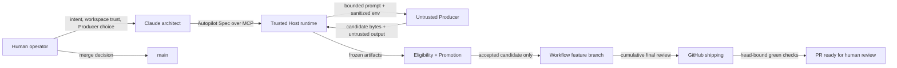

# Trust Boundaries

Claude Architect separates specification, untrusted implementation, policy proof, shipping, and human merge authority. “Trusted” means trusted to enforce a narrow runtime contract, not infallible or safe from a compromised host.

## Boundary 1: human, Claude session, and project settings

The human supplies intent, chooses a Producer when needed, grants Claude Code workspace trust, may record any Candidate Decision after evidence review, and alone may merge or otherwise advance `main`. Claude authors the Autopilot Spec and calls only the narrow MCP surface. The runtime cannot cryptographically authenticate a human gesture; control of the Claude/MCP session remains powerful.

The committed project settings allow the three autopilot calls only after workspace trust. They cannot override managed `ask` or `deny` policy. Consequently “no mid-loop prompts” is conditional, not a guarantee: higher-precedence permission policy or a fail-closed controller outcome may require the human.

## Boundary 2: MCP caller and Host runtime

`autopilotStart`, read-only `autopilotStatus`, and `autopilotResume` accept only checkout identity, validated spec or workflow ID, and protocol version. They expose no eligibility, authority, hash, branch, gate, or arbitrary argv override. The Host validates schema/protocol, repository identity, paths, ownership, locks, and state. Skills and MCP callers cannot construct Autopilot Eligibility, waive gates, push directly, or select a merge operation.

## Boundary 3: Host runtime and Producer

Producers are explicitly untrusted. They receive bounded prompts and sanitized environments in isolated worktrees. Their stdout, summaries, structured reports, test claims, and repository instructions are data, not authority. Candidate freezing rejects scope escapes, traversal, absolute paths, symlink escapes, unsafe submodules, and case-folding path collisions. Independent structural/project verification is required.

Native macOS arm64 Codex editing is certified; eligible Linux Codex editing is tested; native Windows process supervision exists but native Windows Codex editing is not certified. Every OpenCode, Pi, Pythinker, platform, and backend combination is independently capability-gated. Missing confinement fails closed without substitution.

## Boundary 4: candidate evidence, eligibility, and Promotion

A human may record any Candidate Decision. In autopilot, only the trusted Promotion module may record `accepted` with authority `autopilot-policy`, and only when a current hash-bound Autopilot Eligibility record proves all review, verification, advisor, artifact, and base gates. Producers, reviewers, advisors, skills, and MCP callers cannot create or waive that record.

Acceptance authorizes Controlled Integration only into the workflow-owned feature branch. Every task promotion is journaled and becomes a sanitized commit. Reviewers and the advisor are read-only inputs. Final review covers the entire workflow branch and evidence from cumulative interactions across all task commits, not only the latest patch.

## Boundary 5: workflow branch and GitHub shipping

Shipping v1 requires GitHub CLI 2.96 or newer and an authenticated GitHub HTTPS `origin`. The runtime pushes the exact reviewed head, establishes a draft PR identity, and brackets required-check observation with PR identity reads. Only checks configured and green for the expected head permit `mark-ready`; stale or wrong-head results fail closed.

The terms do not collapse: **accepted** permits workflow-branch integration; **shipped** proves the head was pushed and draft PR established; **ready** proves head-bound required checks were green and the PR was marked ready for human review; **merged** means a human advanced `main`. Autopilot never automatically merges, deploys, releases, closes the PR, or deletes the remote branch.

## Boundary 6: workflow state and crash recovery

Workflow state, intent journal, lifetime lease, ownership registration, cumulative evidence, CI observations, and cleanup results are durable. Active or fail-closed workflows retain the workflow worktree/branch when inspection or recovery requires them. Successful ready-state cleanup removes temporary local worktrees, locks, and workflow refs while preserving durable evidence and the remote branch/PR.

Recovery correlates PID plus process-start token, lease and bootstrap ownership, journal entries, and direct Git/filesystem observation. A live owner is preserved byte-for-byte; a provably dead owner may be resumed or disposed only under the recovery table; ambiguity becomes `human-decision-required`. A phase string alone never proves a side effect.

## Boundary 7: local machine and external providers

Cloud Producer/reviewer CLIs can send repository-derived data to their configured providers, and GitHub shipping uses the authenticated CLI. Claude Architect does not control provider retention or provide a universal destination allowlist. Public-beta users must review security-sensitive work and avoid delegating secrets. Confinement and provenance reduce authority; they do not prove generated code safe.
