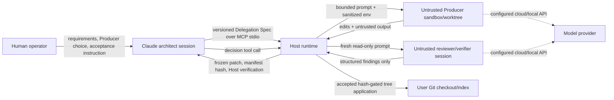

# Trust Boundaries

Claude Architect separates planning and acceptance from untrusted implementation. “Trusted” here means trusted to enforce workflow policy, not infallible or safe from a compromised host.

## Boundary 1: human and architect session

The human supplies intent and should make the final acceptance choice after Claude presents the exact candidate and evidence. Claude constructs the spec and calls MCP tools. The runtime does not cryptographically authenticate a human gesture: `decideCandidate` trusts the controlling MCP client. Consequently, control of the Claude session is equivalent to decision authority. The plugin cannot distinguish a genuine human instruction from a compromised or misbehaving host session.

## Boundary 2: architect session and Host runtime

Communication uses the MCP server over stdio. `src/mcp/server.ts` exposes narrow lifecycle tools rather than a generic shell. The runtime validates protocol/spec versions, canonicalizes checkout paths, serializes repository operations with locks, and rejects nested delegation. The architect controls objective, scope, Producer preferences, verification commands, timeout, and network requests, but cannot bypass runtime validation merely by putting contrary text in the prompt.

The Host runtime is trusted to enforce state, freeze artifacts, and perform independent verification. Its trusted computing base includes Claude Code's process launch, Node.js, the packaged runtime bundle, Git, OS filesystem semantics, platform supervision, and selected sandbox backend.

## Boundary 3: Host runtime and Producer

The Producer CLI and its model are explicitly untrusted. It receives a rendered prompt and a sanitized subset of environment variables and runs in a detached worktree. Codex uses its native sandbox with network disabled and workspace/read-only mode selected by role. Other eligible adapters may be wrapped by macOS Seatbelt. A missing required backend must make an MCP edit lane ineligible rather than silently removing confinement.

The worktree is a containment and observation boundary. The runtime inventories all resulting paths and freezes only changes that match `writeAllowlist` and do not match `forbiddenScope`. Producer stdout, structured reports, test claims, and repository instructions are data, not authority. They cannot record acceptance or call integration because nested MCP startup/delegation is denied and multi-agent behavior is disabled for the certified Codex invocation.

This boundary has limits: readable repository data can be disclosed to a cloud model and sandbox implementations can have defects. Capability gating prevents an unavailable confinement backend from becoming an implicit unconfined or substitute edit path; it does not make an eligible backend infallible.

## Boundary 4: implementation and review contexts

`delegatePipeline` starts fresh one-shot roles. Reviewers receive the spec, baseline/candidate identities, candidate diff, and test evidence inside untrusted delimiters. `src/pipeline/role-prompts.ts` assigns reviewers and the final verifier an empty write allowlist and `forbiddenScope: ["**/*"]`; Codex receives `--sandbox read-only`. A fixer is a separate invocation and alone receives edit authority within the original scope.

Fresh context limits direct conversational influence from the implementer. It does not guarantee that the model provider has no retained account/session data, and it does not prevent prompt injection from the diff itself. Read-only confinement prevents intended file mutation; it does not make the review logically correct.

## Boundary 5: frozen candidate and user checkout

The candidate exists as Git tree/commit objects anchored by a namespaced ref and described by changed-path/content records. The candidate manifest hash binds that normalized manifest; the run manifest separately binds execution provenance and its candidate association. `reviewCandidate` regenerates the exact patch from these objects.

Integration crosses the final commitment boundary. It is allowed only after an `accepted` record and only when the caller supplies the exact manifest hash. The runtime rechecks repository base, candidate anchor, commit/tree, structural identity, clean preconditions, and post-apply state under locks. Integration stages files but does not commit, merge, push, or deploy. The human/architect must inspect the resulting checkout and choose any later Git or release action.

## Boundary 6: local machine and model providers

Cloud Producer and reviewer CLIs send prompts and potentially repository-derived content to their configured providers. Local models may use a local endpoint. Claude Architect does not choose or enforce provider retention policies and has no universal destination allowlist. Network-disabled Codex sandboxing governs tool-side access from the coding process, but the CLI's necessary model transport and provider behavior remain part of the selected CLI/provider trust relationship.
